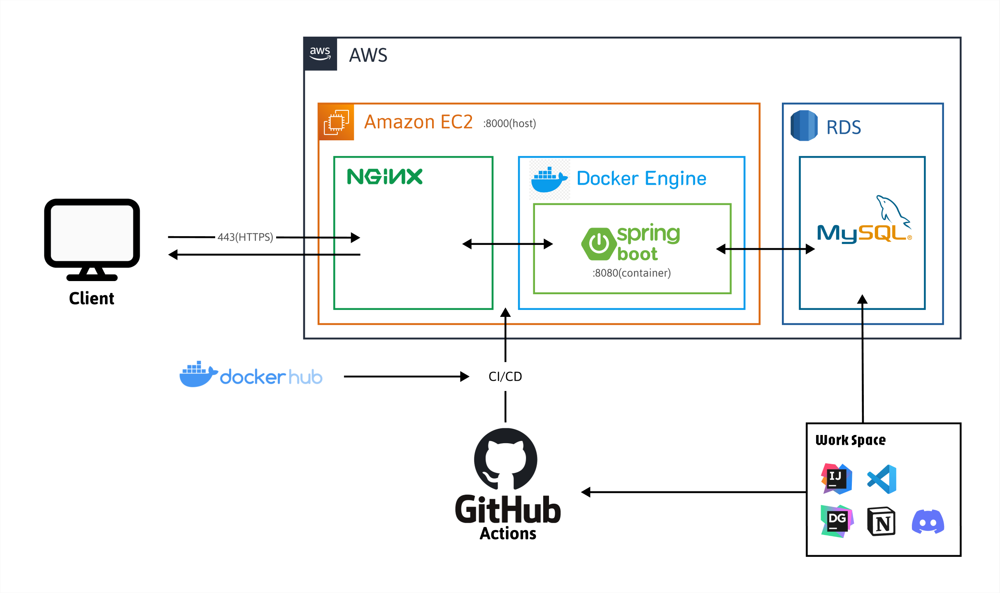
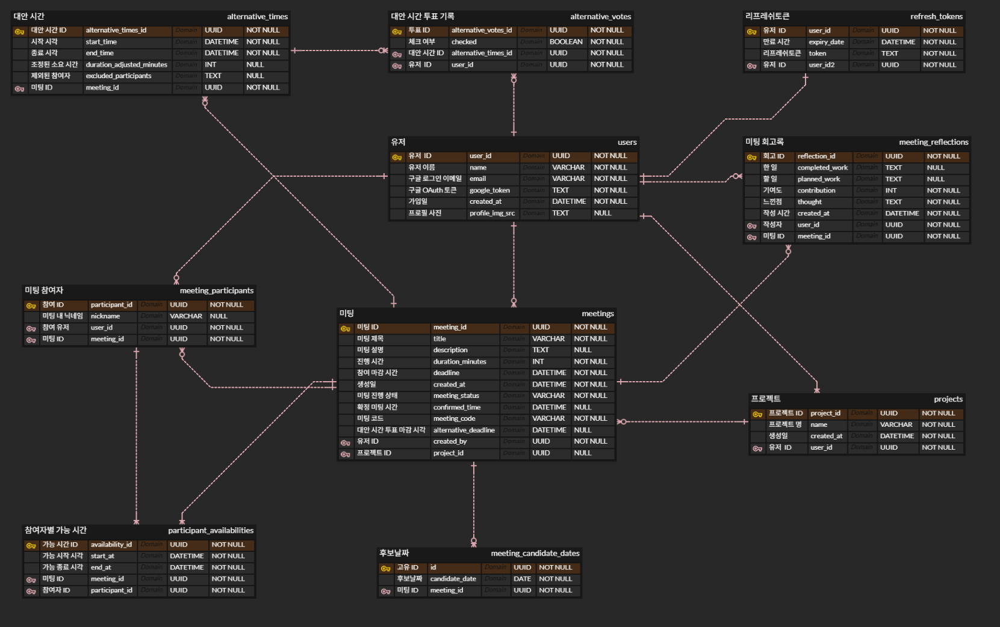

# MeetCha Backend

> 팀 일정 조율·투표·확정까지 한 번에.
Google Calendar 연동 기반의 미팅 스케줄러 백엔드.
> 


## 링크 모음

- 🔗 API 명세서: [API 명세서](https://grey-sedum-df2.notion.site/API-2233a31c4bd980fc8ee9ca4edeaee570?source=copy_link)
- 🌐 운영 베이스 URL: [https://kuit5-meetcha.xyz](https://kuit5-meetcha.xyz)
- 🖼 ERD:  [Meetcha ERD](https://www.erdcloud.com/d/C46Ljm7qCBwsCaF6i)
- 🗂 프론트엔드 레포: [Meetcha FE Repo](https://github.com/Meetcha-DevTeam/frontend-repo)


## 개요

MeetCha 백엔드는 **참여자 가능 시간 수집 → 최적 대안 시간 산출 → 확정/캘린더 반영**의 흐름을 담당합니다.

KST(Asia/Seoul) 기준 운영을 권장하며, DB는 MySQL을 사용합니다.


## 핵심 기능

- OAuth2 기반 로그인(Google)
- 미팅 생성/공유, 참여자 초대
- 타임슬롯 투표(선택 시간 저장)
- 대안 시간 계산 알고리즘(가중치/우선순위 기반)
- 확정 시 Google Calendar 동기화
- 알림/상태 전이


## System Architecture



## Data Model(ERD)



## 기술 스택

| 항목 | 내용 |
| --- | --- |
| Language | Java 17 |
| Framework | Spring Boot 3.5.3 (Gradle - Groovy) |
| Web | Spring MVC (`spring-boot-starter-web`) |
| ORM | Spring Data JPA |
| Database | MySQL |
| Auth | Spring Security + OAuth2 Client (Google) |
| Token Auth | JWT (JSON Web Token, 로그인 후 인증 상태 유지용) |
| Validation | Hibernate Validator (`spring-boot-starter-validation`) |
| Deploy | AWS EC2 |
| Build Tool | Gradle |


## 프로젝트 구조

```
.
├─ .github/               
├─ Dockerfile
├─ build.gradle
└─ src
   ├─ main
   │  ├─ java/com/meetcha
   │  │  ├─ auth          # OAuth/JWT, 인증/인가
   │  │  ├─ external      # 외부 연동(Google)
   │  │  ├─ global        # 공통 설정/예외/유틸
   │  │  ├─ joinmeeting   # 참여/가용시간 선택
   │  │  ├─ meeting       # 미팅 도메인
   │  │  ├─ meetinglist   # 목록/조회
   │  │  ├─ project       # 미팅 프로젝트
   │  │  ├─ reflection    # 미팅 회고
   │  │  └─ user          # 사용자 도메인
   │  └─ resources
   │     ├─ application.properties
   │     ├─ static / templates
   └─ test/java/com/meetcha
      ├─ global.util
      ├─ joinmeeting.service
      └─ meeting

```
